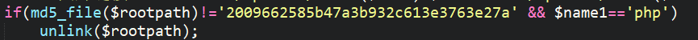
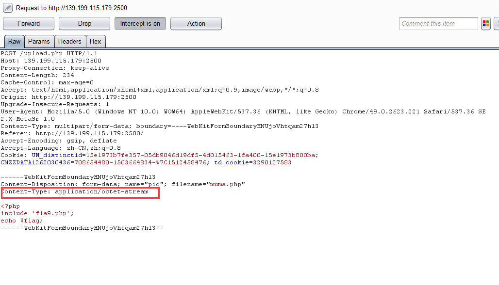

# 题目解析

> **题目名称**：PIC or PHP ?
>
> **题目内容**：小源发现你的这个网站在上传头像处有漏洞，可以上传木马，从而获取到flag。现在小源将木马给你，请你重现一下漏洞。[木马文件](./muma.php)
>
> **题目考点**：php木马利用，文件上传绕过（Content--Type绕过），抓包。
>
> **命题人**：丶诺熙

## 出题思路

一道比较基础的文件上传绕过。

虽然目前这种漏洞已经不多了，但还是希望大家了解一下。

自己想的是随便出一道，然后大家可以通过一些学习，顺便学习到一些其他的绕过方式。

推荐一篇文章，感觉写的蛮全，可以学习一下，另外欢迎大家补充新姿势。

[文件上传检测的多种绕过姿势](http://blog.csdn.net/c465869935/article/details/51800354)

在出题时，自己考虑了，防上传shell后被搅屎，于是直接写死了一个文件，要求上传这个。然后进行获取flag。

上传时，如果绕过Content--Type校验后，还会进行一个判断，以防出现意外。

然而在维护服务器时发现，我的方法还是错的。这样依旧可以被上传shell。事后发现，是自己代码的原因。name1应该是`.php`，自己误写成php了，导致的一个bug。吸取教训，以后注意

## 解题思路

### 预期解法

首先，拿到题，根据题目内容，可以判断出为文件上传。

然后查阅资料，可发现多种上传绕过姿势。

首先审计前台代码，发现无js，所以验证应该是在后端。

然后判断后台判断的是什么，在这里，仅判断了一下文件类型。

所以可以通过抓包修改Content--Type为image/jpeg，从而绕过。

**0x00 配置代理服务器及burpsuite。**

不做过多介绍，自行学习。

**0x01 上传**

首先上传该木马，

然后抓包，修改上传文件的Content--Type

将`application/octet-stream`修改为`image/jpeg`即可。

**0x02 获取flag**

最后，直接点击返回的链接，即可获取到flag。

### 解题情况

在writeup中，看到有小伙伴做了图片马

`copy 1.jpg /b + muma.php /a 2.jpg`

其实这样是没有必要的。做完图片马之后，又将数据包改掉，有点多此一举。

其实大概也能看出来大家的意思。首先我要上传一个图片，然后把他变成木马。

其实完全可以用一个更简单的方法。首先我上传一张真的图片（小点的，否则你会后悔），然后抓包，修改为木马。

图片马，常用在一些有解析漏洞的服务器。在这里，仅仅是一个上传绕过。

