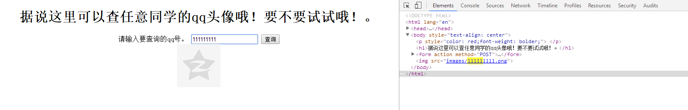

# alert(1) 题目解析

> **题目名称**：alert(1)
> **题目内容**：这是一道简单的xss题。使用alert弹个窗你就赢了，很简单吧？
> **题目考点**：xss基础payload构造
> **命题人**：丶诺熙

## 出题思路
一开始想出一个xss，想了又想，就出个简单的吧。（其实是因为自己水平不够）
然后就出了这个题。一开始想的出两道xss，另一道是打admin的cookie，最后自己死在了bot上。
再加上出题任务繁重，于是就剩这一道题了。

感觉仅仅是个那种的基础页面，有点不好玩，于是就想到了，自己手头还有个腾讯的头像api。然后就加了上去。
`http://qlogo4.store.qq.com/qzone/123456/'.$_POST['echo'].'/100`
做了一个查询头像的页面。
至于alert那里，自己直接将alert重写了一下，然后进行普通的加密。
```
window.alert = function(a) {
    document['getElementsByTagName']('p')[0]['innerHTML'] = 'flag{9uot3s_iz_imp0r7ant}';
    confirm(a)
};
```


## 解题思路

解法有两种，下面我分别介绍一下

### XSS

通过普通的xss方式。
分析页面，会发现你输入的东西在img标签那里。经过测试后，发现这里是可控的，后端没有进行任何过滤。


**在这里教大家一个小技巧，要好好利用搜索，CTRL+F。直接在源代码中使用搜索，搜索输入的文本即可快速定位。实战中也会经常用到。**

构造xss有两种方法，
``

**方法一：使用onerror事件**

构造语句：`1" onerror=alert(1)>`

此时标签为
```
.png">
```

可以看出，此时执行``，后面的`.png">`会被当文字输出。

此时将会查找images/1这个图片是否存在，如果不存在的话，将会执行onerror事件，也就是alert(1)

**方法二：使用`<script>`标签**

构造语句`1"><script>alert(1)</script>`

此时标签为
```
<script>alert(1)</script>.png">
```
可以看出，此时通过闭合img标签，从而达到了执行script语句。


### 代码审计

稍稍有经验一点的，可以通过审计代码，从而发现js文件。

首先，要从一个出题者的思路考虑。即为什么我alert后，你就给我flag？

这件事，如果通过服务器来决定，会很难得。所以最好的方法就是通过本地js。

找到本地js文件后，进行解密，即可获取flag。

以为自己采用的js加密方式是通过百度的脚本进行的，所以解密也很简单。直接百度js解密，会有好多脚本。

以后稍稍有经验，其实也能看出这种js加密方式，从而轻易破解


## 参考资料

最后，给大家分享一些学习xss的资料吧。

黑客游戏 alert(1) to win :https://alf.nu/alert1

合天网 搜索xss：http://hetianlab.com/pages/search.html?wk=xss

