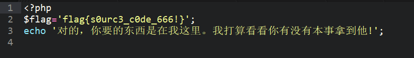

# include flag! 题目解析

> **题目名称**：include flag!
>
> **题目内容**：so ,try to include it ?
>
> **题目考点**：文件包含及php伪协议
>
> **命题人**：丶诺熙

## 出题思路

一道基础的文件包含题目。文件包含也算是一个比较有意思的漏洞吧，CTF比赛中也经常会拿出来考。

但是，实战中暂时还没有见到过，比较可惜。

本题主要考察了php伪协议读源码，没有涉及shell的部分。

因为怕大家不了解，给的提示也都很明显。最后自己有点没hold住手，甚至连源码都给了。

我的错。

## 解题思路

提示很明显 include，很迷，对吧。

部分同学看到get参数的page，误认为是sql注入。

其实只是一个简单的文件包含漏洞。

呃，这个感觉没什么好写的了。

完全看自己的见识了，见多识广，一看见参数为xx.php，就该判断为文件包含的。

然后利用伪协议，读源码即可。

最终的payload为

`http://xxxx.com/?page=php://filter/read=convert.base64-encode/resource=flag.php`

然后解密读到的base64代码，的到源码，flag就在源码中

## 推荐资料

lorexxar大佬写的PHP伪协议介绍
http://lorexxar.cn/2016/09/14/php-wei/

l3m0n师傅写的文件包含漏洞的利用（主要是拿shell）
https://www.cnblogs.com/iamstudy/articles/include_file.html

