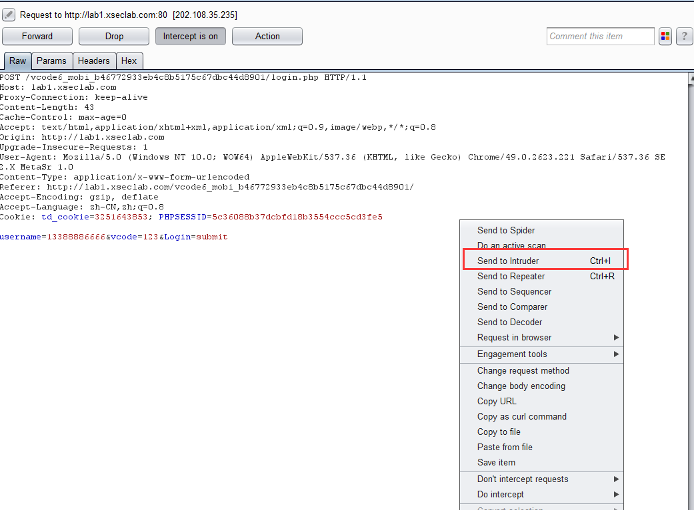
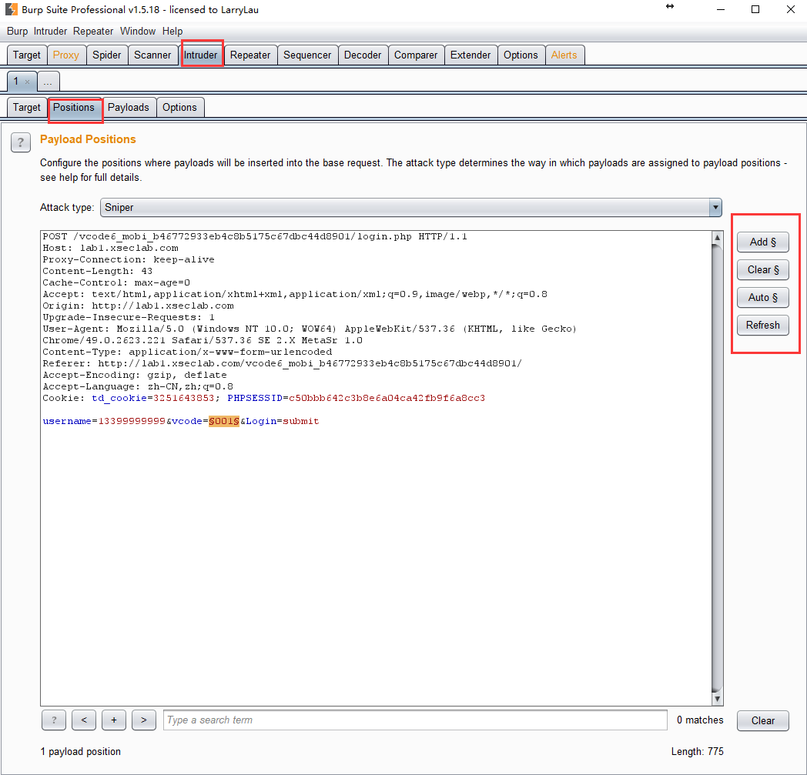
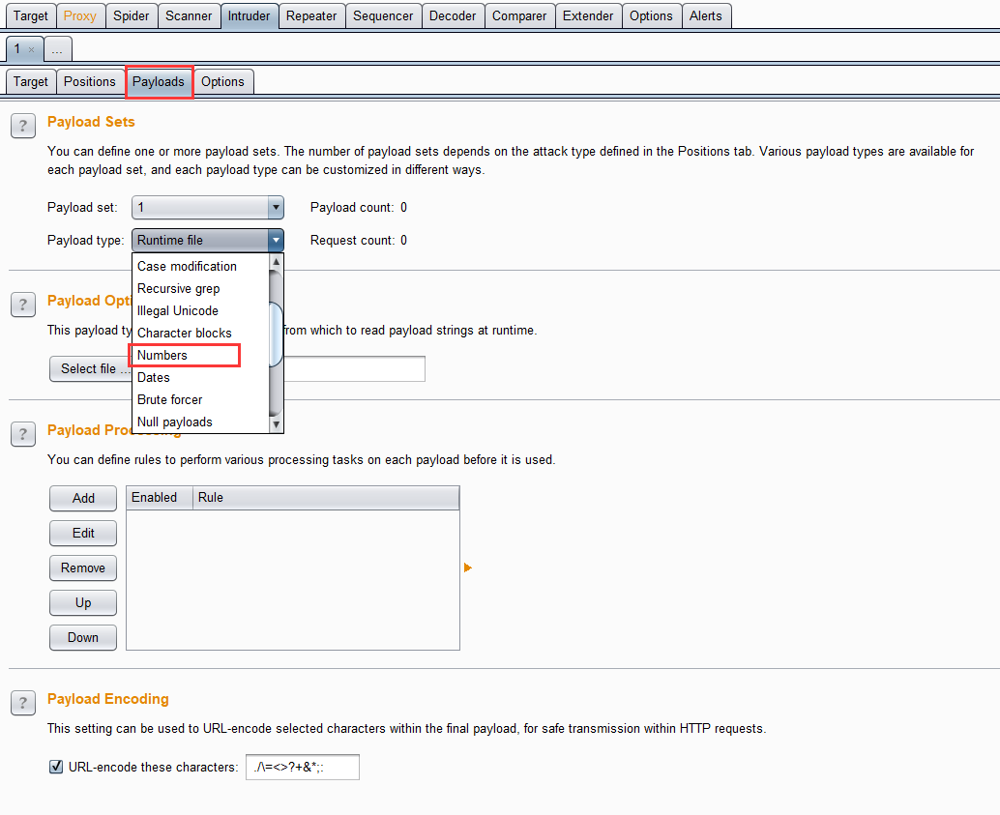
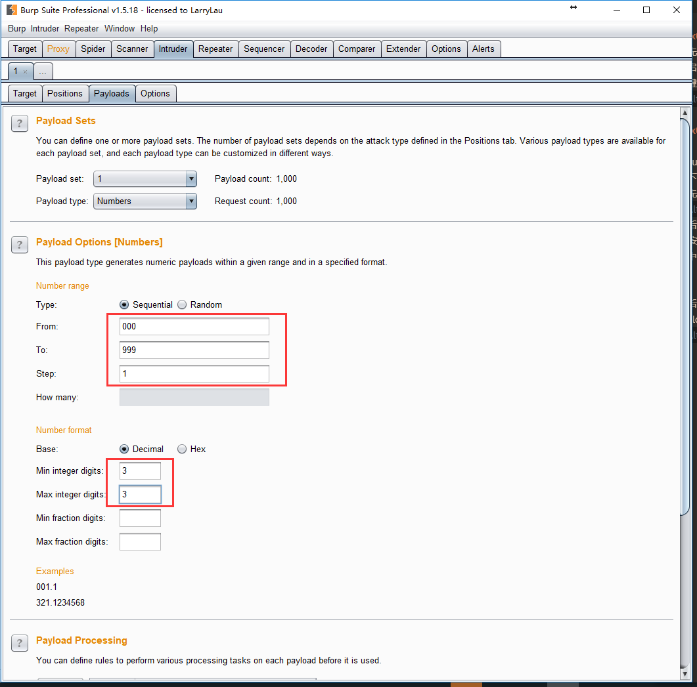
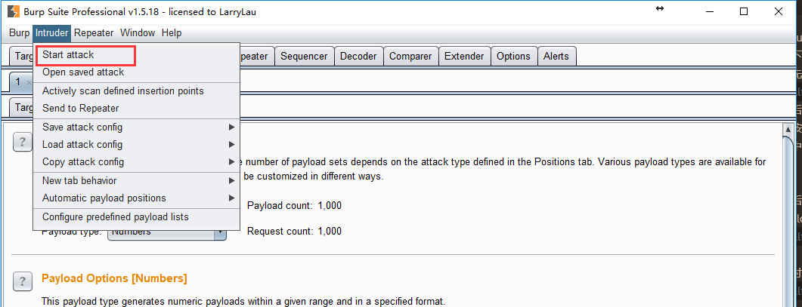
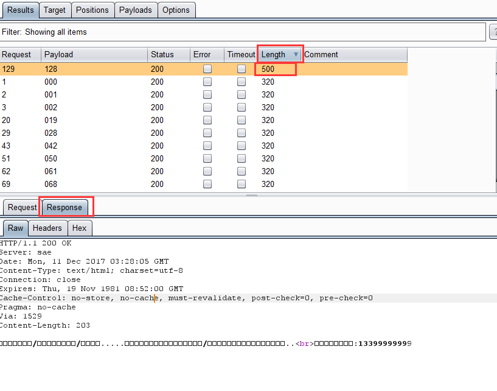
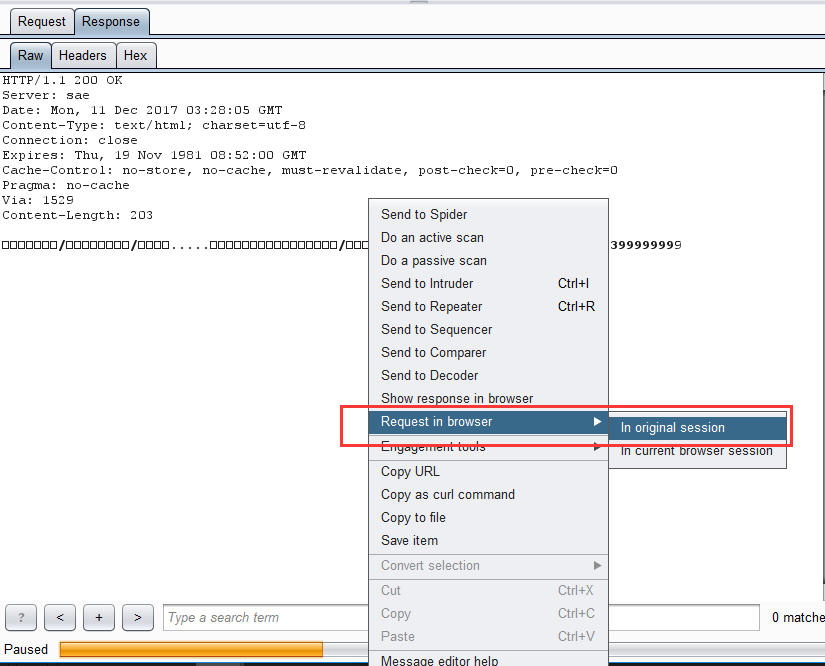

# phone tip! 题目解析

> **题目名称**：phone tip!
>
> **题目内容**：你是一名黑客，你怀疑你的“（男/女）闺蜜”的出轨了，你要登陆TA手机的网上营业厅查看详单，一探究竟！
> 闺蜜手机号码:13388886666
> 营业厅查询网址：http://lab1.xseclab.com/vcode6_mobi_b46772933eb4c8b5175c67dbc44d8901/
>
> **题目考点**：验证码爆破
>
> **命题人**：丶诺熙

## 出题思路

因为自己挖漏洞时，经常发现这些验证码的漏洞，实战性蛮强，所以也想搞一道让大家试一下。学习一下。

这道题自己没有搭建环境，用了xseclab的环境，所以也就成了大家口中的撞车，原题。

推荐学习资料：[任意用户密码重置的10种常见姿势](https://www.ichunqiu.com/course/59049)

## 解题思路

首先拿到题目后，根据提示，应该是让你遍历000-999的验证码，一道爆破的题目。

爆破的方式有很多，python脚本、js代码、burpsuite。

在这里，自己以burpsuite举例吧

**0x00 配置代理服务器及burpsuite**

略略略

**0x01 抓包并发送到intruder**

首先点击获取验证码，获取成功后，输入任意数字后，开启拦截，进行抓包。然后点击submit。如下图，然后右键点击send to intruder

**0x02 intruder爆破**

intruder是burpsuite一个很好用的工具，大家可以深入了解下，在这里自己就简要介绍了。

首先，点击intruder，进入爆破页面。

然后点击positions，进入设置爆破区域页面。右边的四个按钮是设置爆破区域用的。先点击clear，清空，然后选中需要爆破的内容，点击add。即可添加一个爆破的区域。

然后点击payloads，进入设置payloads页面。然后payload type这里可以选择numbers。

此时按如下配置即可。

最后开始爆破

按照lenth排序后，可以轻易看出有一个返回包奇怪，点击response，查看返回包。

此时，会发现有些乱码，可以直接在response信息里面点击右键，如下图，复制到浏览器中打开。

然后进到挂有代理的浏览器，ctrl+v访问即可。

然后看到信息，还需要再爆破一次。在这里就不做演示。

后面可能遇到的问题就是，经过lenth筛选不出来。

多看几次数据包即可，或者添加过滤信息。

这里就不做过多介绍，欢迎大家深入学习下神器burpsuite。

## 其他解法

大家也搜到了好多做法，在这里，我给大家附一下链接吧。

js 解法:http://blog.csdn.net/kostart123/article/details/53763173