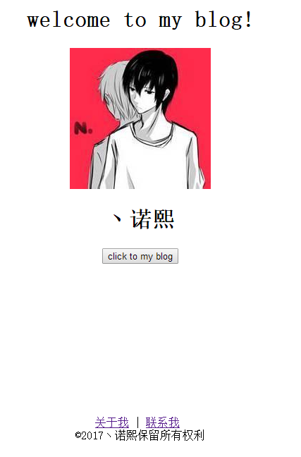
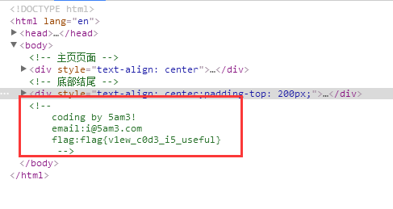

# 题目解析

> **题目名称**：whose blog!
> **题目内容**：boss发话了。这个博客上有些言论不太好。你去帮忙调查一下。收集一些资料来准备后面的渗透。
> **题目考点**：信息收集、HTML代码结构。
> **命题人**：丶诺熙

## 出题思路

这道题主要是想让大家了解一下HTML的编码格式。
以及渗透测试中常用的获取信息的方法。
之前xnuca第三场学到的。当时那道题是，在外部JS代码中有作者信息。（一般大项目，每一段的作者一般会将自己的信息附上，方便后期维护）
然后可以通过作者id，及邮箱去查github，然后找到泄露的源码。获取敏感信息。
本来自己也想这样的，但是考虑到，大多数同学不熟悉github，所以先放弃了。出了一道简单点的。

## 解题思路

首先看到题目，先审题，题目要求是收集资料。
打开网页。发现只是一个博客的欢迎页。

其他链接都无法点击。所以只能从这个页面入手。
首先可以知道博客的主人为丶诺熙。但是这完全不够。
于是进而应该想到查看源代码，或者查看网络请求。
在深入一点，应该想到扫描目录，看看有没有敏感文件泄露。

当然，这里没有太难，只要审查元素，就会发现一行作者信息。

所以，最终flag为：flag{v1ew_c0d3_i5_useful}

